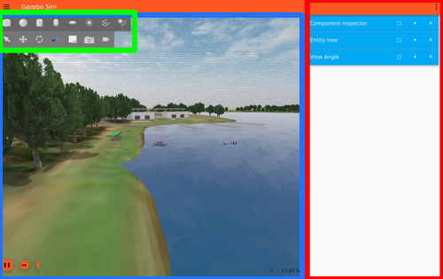

{ #gazebo }
# gazebo
gazebo is a simulation program we use to test our boat!
instead of taking out our boat every time we need to test code, we simply run gazebo!
* at the time of writing (2024), we are using Gazebo Garden. this should come preinstalled with the docker installation

## how to use gazebo
launch gazebo using the command below:
`ros2 launch vrx_gz competition.launch.py world:=sydney_regatta`
once you open up gazebo, you'll probably be greeting with a frozen screen. don't worry, this is normal. give it a minute of two :]

## navigating gazebo

### toolbar
### main view
### panels
1. click the 3 buttons on the top right corner
2. type out the panel you want to add
3. profit?
